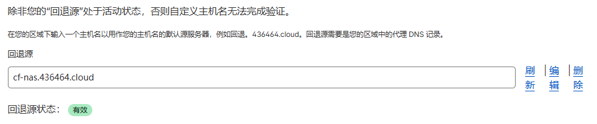
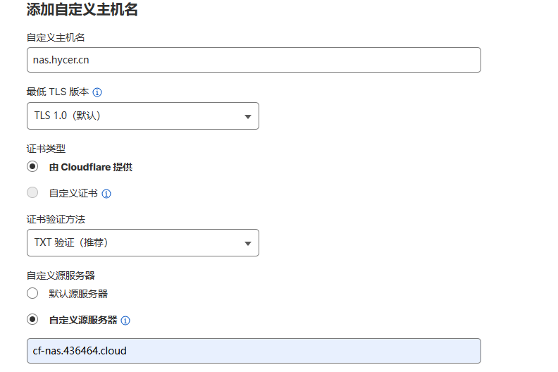
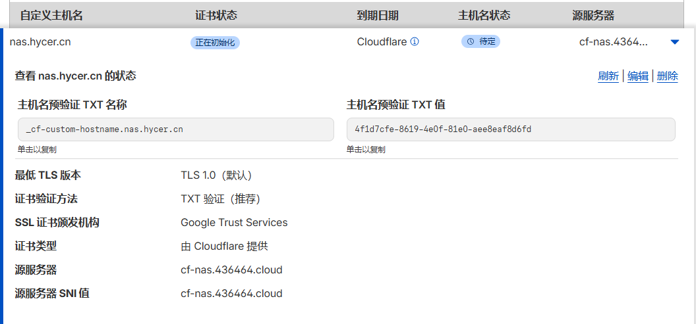
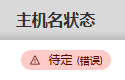
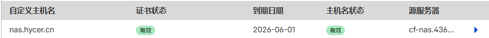
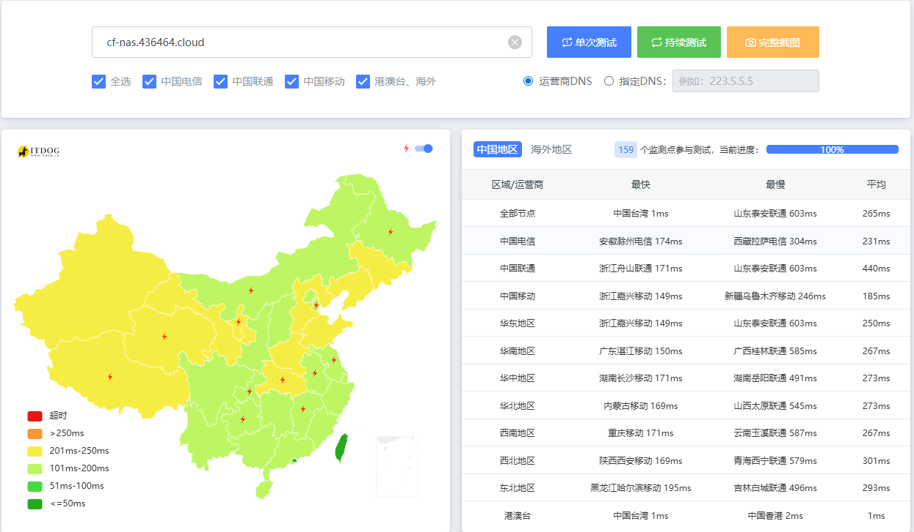
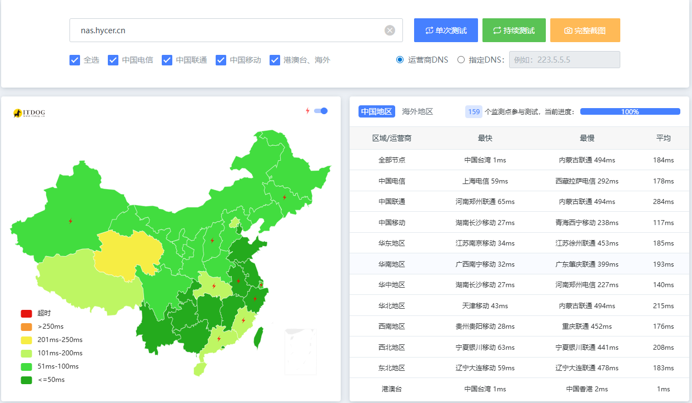

# Cloudflare Tunnel优选域名加速

## 环境要求

* 1.已部署好Cloudflare Tuunel
* 2.Cloudflare账户下拥有两个域名，一个主访问域名，一个加速域名
    
    * 本文我以`hycer.cn`为主域名，`436464.cloud`为加速域名为例

_注意：优选域名加速只会降低访问延迟，并不会增加网络带宽_

##  操作步骤

### 为Tunnel应用绑定域名

* 1.本文以加速内网nas服务为例，为nas服务绑定`nas.hycer.cn`、`cf-nas.436464.cloud`的两个域名，前者将作为最终访问服务的域名，也就是主访问域名，后者作为加速域名，实际通过该域名访问隧道的访问。在Tunnel的“已发布应用程序路由”中可以绑定域名，绑定成功后会自动添加DNS解析，如下图。确保两个域名都可以访问应用。
    

### 配置回退源和自定义主机名

* 1.来到**加速域名**，进入“SSL/TLS”的自定义主机名界面，将加速域名添加为回退源，确保回退源的状态为有效
    

* 2.点击添加“自定义主机名”按钮，配置自定义主机名。自定义主机名为主访问域名，自定义源服务器为加速域名
    

* 3.添加后，Cloudflare会验证主机名状态和证书状态，确保我们拥有该域名的控制权。按照要求在主域名中配置TXT解析即可
    
    
配置解析后可能会显示“待定（错误）”的报错，此处为bug，删除TXT解析重新添加即可。若仍不行，可以先将主域名`nas.hycer.cn`的解析CNAME到加速域名上
    

确保主机名状态和证书状态均为有效即可
    

### 配置优选域名

* 来到**加速域名**的DNS记录，配置一个CNAME解析到[优选域名](https://www.wetest.vip/page/cloudflare/cname.html)，优选域名可自行网上查找;此处以将`speedup.436464.cloud`解析到优选域名`youxuan.cf.090227.xyz`为例。**注意关闭小黄云，取消代理**
    

### 主域名指向优选域名

* 最后回到**主域名**的DNS记录，将原指向Tunnel的`nas.hycer.cn`指向加速域名`speedup.436464.cloud`，**注意关闭小黄云，取消代理**.至此Tunnel的优选域名加速配置完成
    

### 加速验证

分别ping直连域名`cf-nas.436464.cloud`和加速后的主域名`nas.hycer.cn`

加速前：
    

加速后：
    

## 核心原理解析

|域名角色|示例|作用|
|---|---|---|
|主访问域名|nas.aaa.com|用户实际访问的域名，最后指向优选线路|
|回退源域名（Tunnel 域名）|cf-nas.bbb.com	|绑定真实 Cloudflare Tunnel，作为回源锚点|
|优选域名|ip.ccc.com|指向优选 IP / 优选域名，负责加速|

* 最终流量路径
    * 1.用户访问 `nas.aaa.com` → DNS 解析到 `ip.ccc.com`（优选线路）。
    * 2.流量到达 Cloudflare 优选节点，请求头Host为 `nas.aaa.com`。
    * 3.Cloudflare 识别为 SaaS 自定义主机名，内部回源到 `cf-nas.bbb.com`。
    * 4.`cf-nas.bbb.com` 绑定的Tunnel将流量转发到内网NAS。