## 实验环境

* Ubuntu24.04 4C4G虚拟机
* 数据盘类型覆盖：scsi，virtio
* mdadm版本：4.3-1ubuntu2.1

## 实验前准备

* 挂载数据盘：根据组建的RAID级别挂载相应数量的数据盘
* 安装mdadm：

```shell
sudo apt install mdadm
```

## RAID 0

### 组建RAID 0

* 1.挂载两块virtio格式容量50GB的硬盘
* 2.创建RAID 0阵列
  
```shell
mdadm -C /dev/md0 -l 0 -n 2 /dev/vdb /dev/vdc

# -C --create参数，创建RAID阵列
# /dev/md0 为组建RAID后的设备名
# -l --level参数，创建的RAID级别
# -n --raid-devices= 参数，组建RAID的设备数及具体设备路径
```

创建好后lsblk应为如下的状态：

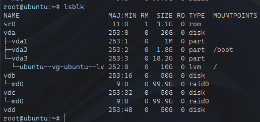

* 3.检查RAID状态

```shell
mdadm --detail /dev/md0
```

```shell
root@ubuntu:~# mdadm --detail /dev/md0
/dev/md0:
           Version : 1.2
     Creation Time : Fri Nov 14 02:53:01 2025
        Raid Level : raid0                  # RAID级别
        Array Size : 104790016 (99.94 GiB 107.30 GB)
      Raid Devices : 2
     Total Devices : 2
       Persistence : Superblock is persistent

       Update Time : Fri Nov 14 02:53:01 2025
             State : clean
    Active Devices : 2
   Working Devices : 2
    Failed Devices : 0
     Spare Devices : 0

            Layout : original
        Chunk Size : 512K

Consistency Policy : none

              Name : ubuntu:0  (local to host ubuntu)
              UUID : ad31c8f6:e775ff93:17548363:43669993
            Events : 0

    Number   Major   Minor   RaidDevice State       # RAID成员及状态
       0     253       16        0      active sync   /dev/vdb
       1     253       32        1      active sync   /dev/vdc
```

### 检验

* 1.挂载一块50GB的virtio硬盘用于做对比实验
* 2.格式化并挂载文件系统

```shell
# 格式化RAID设备和对照组硬盘为ext4格式
mkfs.ext4 /dev/md0
mkfs.ext4 /dev/vdd

# 创建两个挂载点 并挂载文件系统
mkdir /mnt/raid0 /mnt/noraid0

mount /dev/md0 /mnt/raid0/
mount /dev/vdd /mnt/noraid0/
```

* 3.写入测试

```shell
# 使用dd命令顺序写入8GB文件，观察写入速度
dd if=/dev/zero of=/mnt/noraid0/testfile bs=1G count=8 oflag=direct

dd if=/dev/zero of=/mnt/raid0/testfile bs=1G count=8 oflag=direct
```

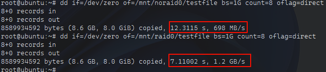

可以发现速度提升几乎翻倍

* 4.读取测试

```shell
# 使用dd命令顺序读取刚才写入的文件，观察读取速度
dd if=/mnt/noraid0/testfile of=/dev/null bs=1G count=8 iflag=direct

dd if=/mnt/raid0/testfile of=/dev/null bs=1G count=8 iflag=direct
```

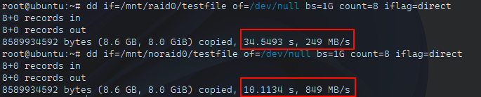

读取速度也是大幅度提升

## RAID 1

### 组建RAID 1

* 1.挂载两块scsi格式容量50GB的硬盘
* 2.创建RAID 1阵列
  
```shell
mdadm -C /dev/md1 -l 1 -n 2 /dev/sda /dev/sdb 
```

* 3.检查RAID状态

```shell
# 在刚创建RAID 1后使用 watch 指令每隔1秒更新查看mdstat文件
watch -n 1 "cat /proc/mdstat" 
```

可以看到

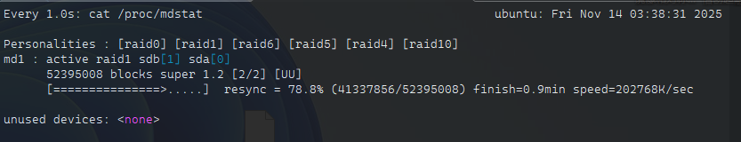

代表两块硬盘正在同步数据

同步完成后

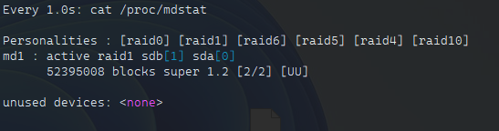

`[UU]`代表两块硬盘都处于UP状态，RAID 1阵列已准备就绪

### 检验

* 1.格式化并挂载文件系统

```shell
# 格式化RAID设备和对照组硬盘为ext4格式，并挂载文件系统
mkfs.ext4 /dev/md1
mkdir /mnt/raid1
mount /dev/md1 /mnt/raid1/
```

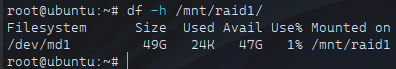

可以看到实际容量为两块硬盘容量之和的50%

* 2.冗余测试

* 创建初始文件
  
```shell
cd /mnt/raid1
# 使用dd命令写入500M初始文件文件并记录md5值至文件中
dd if=/dev/zero of=base_file.bin bs=1M count=500 status=progress

md5sum base_file.bin > /tmp/base_file_original.md5
```

* 创建持续写入脚本stress_write.sh

```shell
#!/bin/bash
STRESS_DIR="/mnt/raid1"
LOG_FILE="/tmp/stress_io.log"

echo "$(date): Starting continuous write process..." | tee -a $LOG_FILE

counter=1
while true; do
    # 创建一个不断增长的文件，并每次写入都刷新
    echo "This is a continuous write stream at $(date). Loop counter: $counter" >> $STRESS_DIR/continuous_write.log
    sync # 强制写入磁盘
    dd if=/dev/urandom of=$STRESS_DIR/random_data_$counter.bin bs=1M count=10 status=none
    ((counter++))
    # 输出状态点
    if (( $counter % 5 == 0 )); then
        echo "$(date): Written $counter files so far..." | tee -a $LOG_FILE
    fi
done
```

赋予脚本执行权`chmod +x stress_wirte.sh`
运行脚本`./stress_write.sh`

* 新开终端窗口，观察RAID状态

```shell
watch -n 1 'cat /proc/mdstat && echo "---" && mdadm --detail /dev/md1 | grep -E "State|Devices"'
```

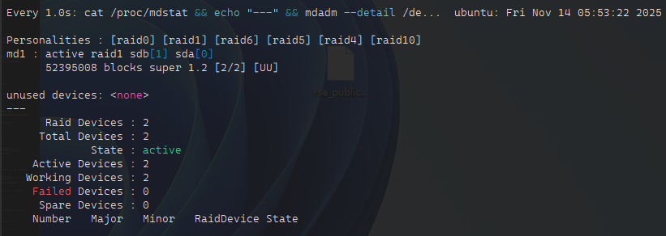

* 新开终端窗口，观察系统io监控

```shell
watch -n 1 'iostat -xd 1 1 /dev/sda /dev/sdb | tail -n +3'
```

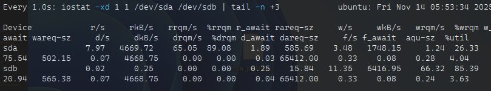

* 将磁盘sdb标记为故障并移除

```shell
mdadm /dev/md1 --fail /dev/sdb
mdadm /dev/md1 --remove /dev/sdb
```

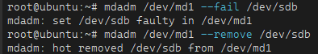

* 可以看到设备虽处于降级状态，但剩余设备仍在工作
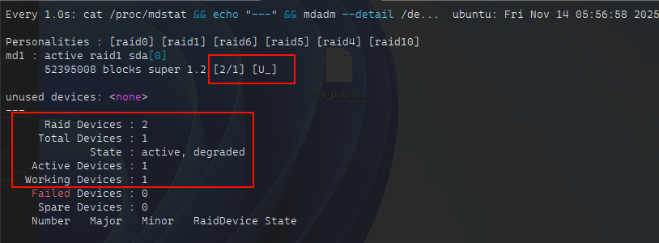

* 验证数据可访问性

对比初始文件的md5值，验证文件并无损坏

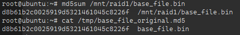

* 重新添加sdb

```shell
mdadm /dev/md1 --add /dev/sdb
```

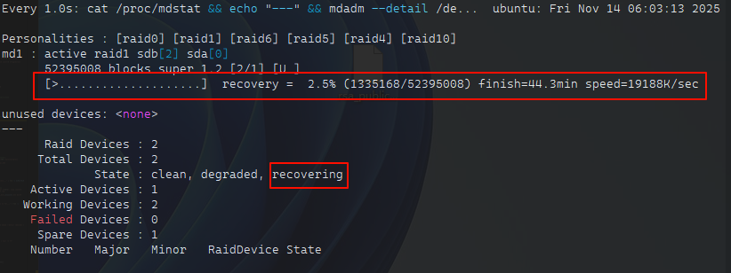
可以看到正在重建同步数据

* 等待重建完成后再次检查初始文件的md5值

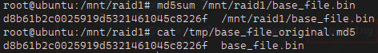

## RAID 5

### 组建RAID 5

* 1.挂载3块250G的scsi硬盘
* 2.创建RAID 5阵列

```shell
mdadm -C /dev/md0 -l 5 -n 3 /dev/sda /dev/sdb /dev/sdc
```

```shell
watch -n 1 "cat /proc/mdstat"
```

查看同步进度

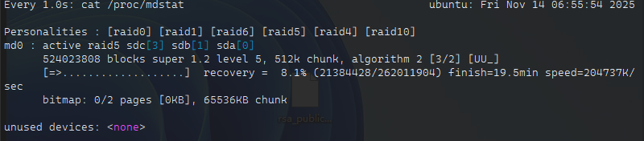

同步完成

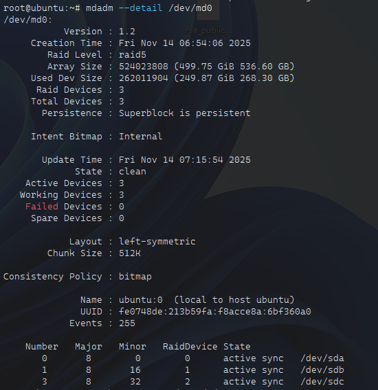

### 检验

* 1.准备测试数据
  
```shell
mkfs.ext4 /dev/md0
mkdir /mnt/raid5
mount /dev/md0 /mnt/raid5

# 创建校验文件
dd if=/dev/urandom of=/mnt/raid5/test_file.bin bs=1M count=2000 status=progress
md5sum /mnt/raid5/test_file.bin > /tmp/raid5_original.md5
cat /tmp/raid5_original.md5
```

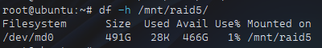

可以发现md0挂载的实际容量为（磁盘数-1）*单个磁盘容量

* 2.移除硬盘sdb

```shell
mdadm /dev/md0 --fail /dev/sdb
mdadm /dev/md0 --remove /dev/sdb

# 检查状态，现在是降级状态
mdadm --detail /dev/md0
```

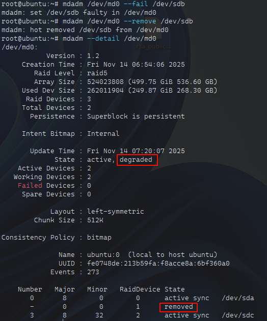

* 3.在降级状态下验证数据可访问性

```shell
md5sum /mnt/raid5/test_file.bin

cat /tmp/raid5_original.md5

echo "RAID 5 is working in degraded mode!" | tee /mnt/raid5/degraded_test.txt
cat /mnt/raid5/degraded_test.txt
```

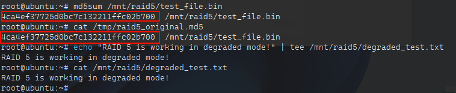

* 4.重新添加sdb

```shell
mdadm /dev/md0 --add /dev/sdb
```

再次校验md5值

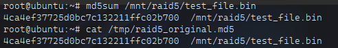

* 5.读写性能测试（挂载一块500GB scis类型硬盘并挂载为ext4文件系统）

```shell
# 测试顺序写入8G文件
dd if=/dev/zero of=/mnt/noraid5/largefile.bin bs=1G count=8 oflag=direct status=progress

dd if=/dev/zero of=/mnt/raid5/largefile.bin bs=1G count=8 oflag=direct status=progress

# 测试顺序读取8G文件
dd if=/mnt/noraid5/largefile.bin of=/dev/null bs=1G count=8 iflag=direct status=progress

dd if=/mnt/raid5/largefile.bin of=/dev/null bs=1G count=8 iflag=direct status=progress
```

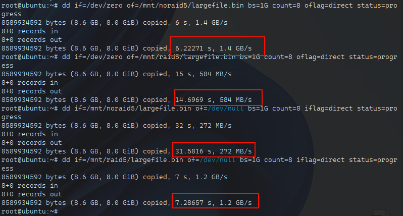

可见RAID 5因需要奇偶校验导致写入速度反而比没有组RAID的硬盘还要慢；但读取速度远高于未组RAID的普通硬盘
