本文采用VMWare虚拟机环境进行双系统的安装

## Win11系统安装

* 正常安装windows系统，将需要安装ArchLiunx的分区分出来，方便后续安装

## ArchLinux系统安装

### 进入ArchLinux安装系统

* 1.win11虚拟机的cdrom挂载上ArchLinux的安装镜像
  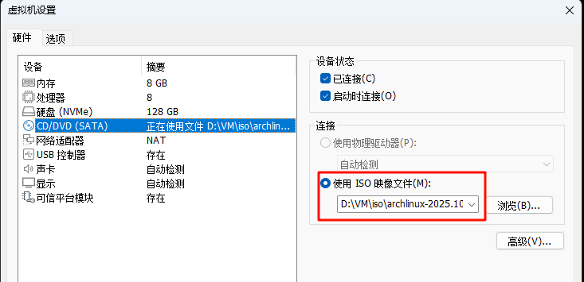

* 2.重启虚拟机，按`ESC`进入BootManager页面，选择从CDROM启动

### 连接网络（使用有线连接可跳过）

* 1.输入`iwctl`进入网络管理界面
* 2.`device list` 列出无线网卡设备名，比如无线网卡 `wlan0`
* 3.`station wlan0 scan` 扫描网络
* 4.`station wlan0 get-networks` 列出所有 wifi 网络
* 5.`station wlan0 connect wifi-name` 进行连接，注意这里无法输入中文。回车后输入密码即可
* 6.`exit` 连接成功后退出

### 磁盘分区

ArchLinux至少需要如下3个分区
```text
/ # 根目录
/boot # boot分区
/swap # swap分区
```

* 1.使用`lsblk`查看当前分区情况
  
  硬盘`nvme0n1`为安装ArchLinux系统的目标硬盘，其中1~4分区为windows系统使用
* 2.使用`cfdisk /dev/nvme0n1`进入分区操作
* 3.选中`free space`,使用`New`选项新建分区
  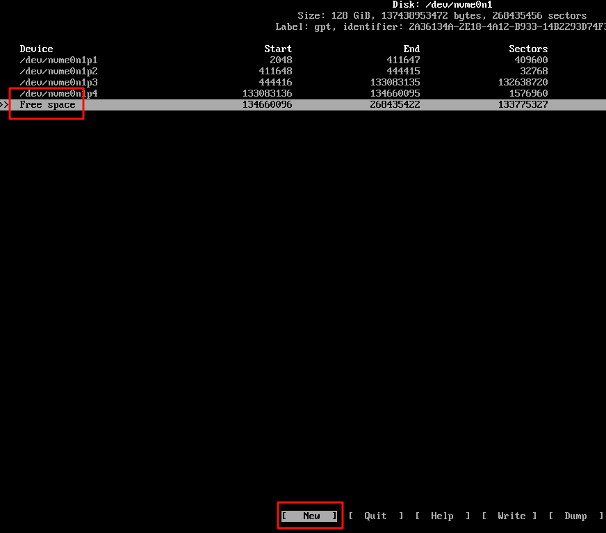
* 4.分区大小为1G，用作boot分区
* 5.重复分区操作，将swap分区划分出来，并将剩余空间用作根分区
  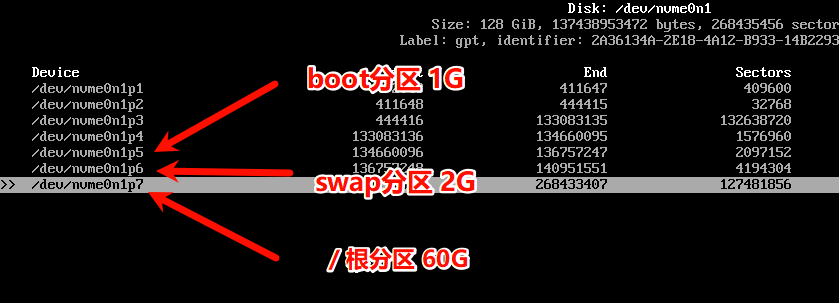
* 6.选中`Write`回车，输入`yes`保存更改，最后`Quit`推出
* 7.格式化分区，依次执行以下指令，将boot分区格式化为`fat32`，swap分区格式化为`linuxswap`，根目录格式化为`ext4`
  ```shell
  mkfs.vfat -F32 /dev/nvme0n1p5
  mkswap /dev/nvme0n1p6
  mkfs.ext4 /dev/nvme0n1p57
  ```   
  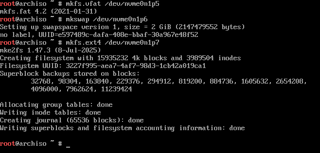
* 8.挂载根目录
  ```shell
  mount /dev/nvme0n1p7 /mnt
  ```
* 9.采用Linux和Windows独立boot分区，创建boot目录并挂载boot分区
  ```shell
  mkdir -p /mnt/boot
  mount /dev/nvme0n1p5 /mnt/boot
  ```
  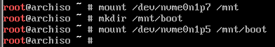
* 10.启用swap分区
  ```shell
  swapon /dev/nvme0n1p6
  ```
* 11.使用`lsblk`检查分区
  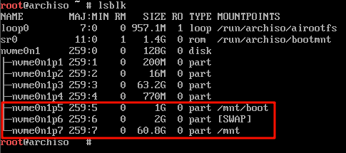

### pacman换源

* 1.使用`vim`编辑器修改`/etc/pacman.d/mirrorlist`文件。将`pacman`软件仓库源更换为国内软件仓库镜像源：
  ```shell
  vim /etc/pacman.d/mirrorlist
  ```
  推荐将如下软件源配置在最前
  ```text
  Server = https://mirrors.ustc.edu.cn/archlinux/$repo/os/$arch # 中国科学技术大学开源镜像站
  Server = https://mirrors.tuna.tsinghua.edu.cn/archlinux/$repo/os/$arch # 清华大学开源软件镜像站
  Server = https://repo.huaweicloud.com/archlinux/$repo/os/$arch # 华为开源镜像站
  Server = http://mirror.lzu.edu.cn/archlinux/$repo/os/$arch # 兰州大学开源镜像站
  ```
  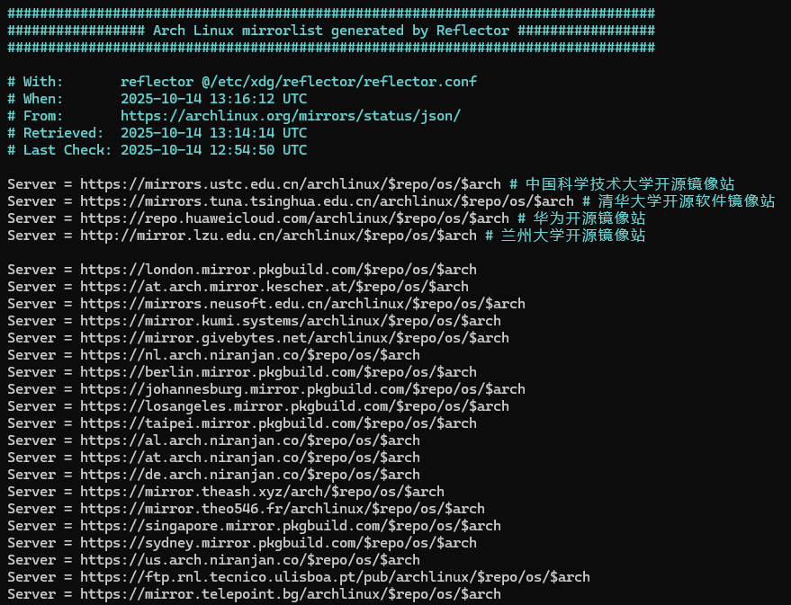

* 2.更新软件源
  ```shell
  pacman -Syy
  ```

### 安装系统

* 1.安装基本系统
  ```shell
  pacstrap /mnt base base-devel linux-zen linux-zen-headers linux-firmware vim nano e2fsprogs ntfs-3g
  ```
  **这里使用的linux-zen内核**

  如果提示GPG证书错误，可能是因为使用的不是最新的镜像文件，可以通过更新 `archlinux-keyring` 解决此问题
  ```shell
  pacman -S archlinux-keyring
  ```
* 2.安装其余软件
  ```shell
  pacstrap /mnt networkmanager vim sudo zsh zsh-completions
  ```
  * pacstrap: Arch Linux 的专用安装脚本，用于将软件包安装到指定目录
  * /mnt: 新系统的根目录挂载点

* 3.生产`fstab`文件
  ```shell
  genfstab -U -p /mnt >> /mnt/etc/fstab
  ```
* 4.检查`fstab`文件
  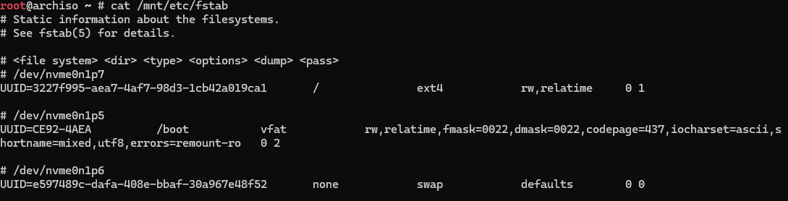
* 5.切换并进入新系统
  ```shell
  arch-chroot /mnt
  ```
  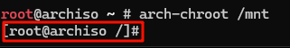

### 系统初始配置

* 1.设置root密码
  ```shell
  passwd
  ```
* 2.添加隶属于wheel组的普通用户，并设置密码
  ```shell
  useradd -m -G wheel -s /bin/zsh hycer # 添加普通用户hycer并指定使用的终端为zsh
  passwd hycer # 设置密码
  ```
* 3.修改sudoers，使普通用户能临时获取root权限
  ```shell
  vim /etc/sudoers
  ```
  找到`# %wheel ALL=（ALL）ALL`并取消注释
  

* 4.根据自己的CPU安装对应平台的微码
  ```shell
  pacman -S intel-ucode
  pacman -S amd-ucode
  ```

* 5.安装Grub引导，提供双系统选择入口
  ```shell
  pacman -S grub efibootmgr os-prober
  ```

* 6.安装Grub配置文件
  ```shell
  grub-install --target=x86_64-efi --efi-directory=/boot --bootloader-id=Arch --recheck
  ```
* 7.修改Grub配置文件
  ```shell
  vim /etc/default/grub
  ```
  找到`#GRUB_DISABLE_OS_PROBER=false`并取消注释
  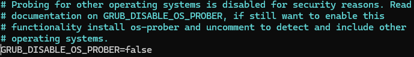

* 8.生成Grub配置文件
  ```shell
  grub-mkconfig -o /boot/grub/grub.cfg
  ```

  若引导了 win10，则输出应该包含倒数第二行：
  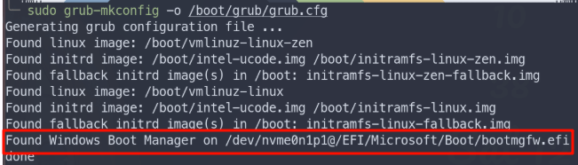
  没有也没关系，后面重启进入系统后再次生成配置文件即可

* 9.配置语言和区域
  ```shell
  vim /etc/locale.gen
  ```
  分别找到如下字符，取消注释
  ```text
  #en_US.UTF-8 UTF-8
  #zh_CN.UTF-8 UTF-8
  #zh_TW.UTF-8 UTF-8
  ```
  刷新区域信息,并设置语言
  ```shell
  locale-gen

  echo LANG=en_US.UTF-8 > /etc/locale.conf
  ```
* 10.修改时区
  ```shell
  ln -sf /usr/share/zoneinfo/Asia/Shanghai /etc/localtime
  ```
### 安装kde

* 1.安装kde
  ```shell
  pacman -S plasma sddm konsole dolphin ark gwenview
  ```
  过程中的选项采用默认即可

* 2.设置ssdm开机自启
  ```shell
  systemctl enable sddm
  ```

* 3.安装字体
  ```shell
  pacman -S wqy-microhei
  ```

* 4.安装输入法和浏览器
  ```shell
  pacman -S firefox
  pacman -S fcitx5-im fcitx5-chinese-addons fcitx5-rime
  pacman -S wget
  ```

  输入法需设置环境变量
  ```shell
  vim /etc/environment
  ```
  加入以下几行
  ```text
  GTK_IM_MODULE=fcitx
  QT_IM_MODULE=fcitx
  XMODIFIERS=@im=fcitx
  SDL_IM_MODULE=fcitx
  GLFW_IM_MODULE=ibus
  ```

* 5.退出当前系统，并重启,即可进入新系统
  ```shell
  exit
  reboot
  ```

* 6.别忘记重新写入Grub配置文件
  ```shell
  sudo grub-config -o /boot/grub/grub.cfg
  ```