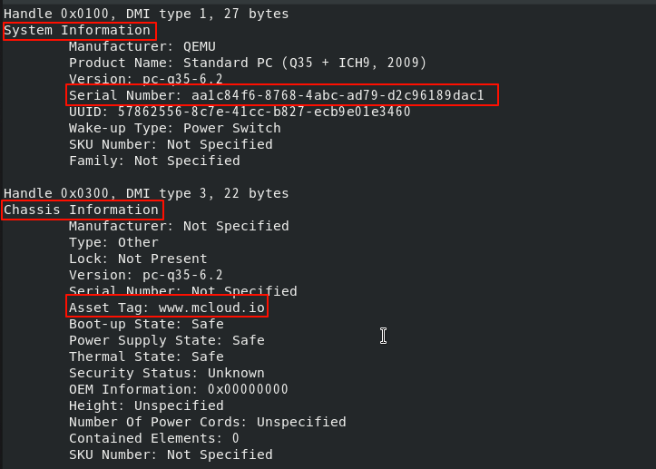
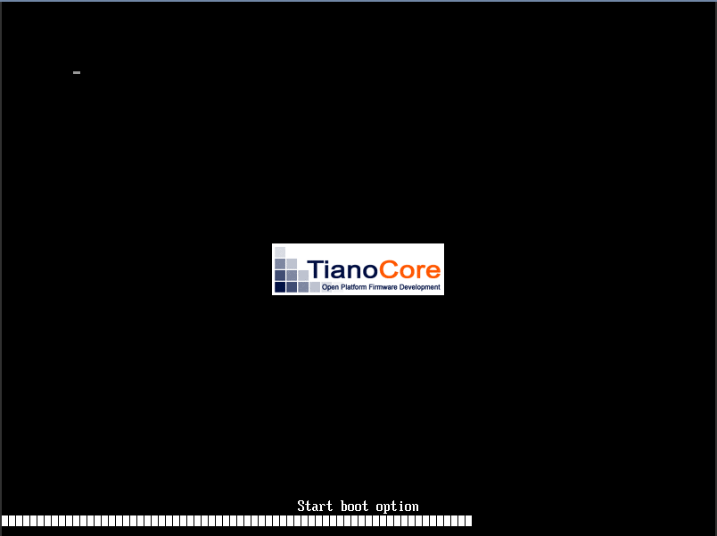

**在对应物理机上使用`virsh dumpxml [虚拟机UUID]`即可查看虚拟机的xml配置文件**

## 根标签

```xml
<domain type='kvm' id='34' xmlns:qemu='http://libvirt.org/schemas/domain/qemu/1.0'>
```

* `<domain>`: 定义虚拟机的根元素。
* **`type='kvm'`: 使用KVM虚拟化技术。**
* `id='34'`: 该虚拟机在Libvirt守护进程中的运行时ID，重启后会变化。
* `xmlns:qemu`: 引入QEMU命名空间，用于添加QEMU特有的命令行参数。

## 元数据与标识

```xml
<name>578625568c7e41ccb827ecb9e01e3460</name>
<uuid>57862556-8c7e-41cc-b827-ecb9e01e3460</uuid>
<description>hml-1004-rd8-u</description>
<metadata xmlns:mc="http://www.macrosan.com/">
  <mc:mcloud>
    <internalId>609</internalId>
    <hostManagementIp>172.20.2.208</hostManagementIp>
  </mc:mcloud>
</metadata>
```

* `<name>`: 虚拟机的唯一名称。
* `<uuid>`: 虚拟机的全局唯一标识符
* `<description>`: 描述。
* `<metadata>`: 用于存储自定义元数据。这里是mcloud管理平台的信息，包括内部ID和管理主机IP。

## 资源分配

```xml
<memory unit='KiB'>4194304</memory>
<currentMemory unit='KiB'>4194304</currentMemory>
<vcpu placement='static'>4</vcpu>
<cputune>
  <shares>512</shares>
</cputune>
<resource>
  <partition>/machine</partition>
</resource>
```

* `<memory>`: 虚拟机最大可使用的内存大小（4GiB）。
* `<currentMemory>`: 虚拟机**启动时分配的内存大小**，通常与`<memory>`相同，但可配置ballooning驱动进行动态调整。
* `<vcpu>`: **虚拟CPU数量**。placement='static'表示CPU数量在运行时不可改变。
* `<cputune>`: CPU调度调优。
     `<shares>512</shares>`: 相对权重，用于在主机CPU资源紧张时决定各虚拟机的CPU时间分配比例。
* `<resource>`: 资源分区设置，用于cgroups管理。/machine表示此虚拟机位于根分区。

## 系统信息 (SMBIOS)

```xml
<sysinfo type='smbios'>
  <system>
    <entry name='serial'>aa1c84f6-8768-4abc-ad79-d2c96189dac1</entry>
  </system>
  <chassis>
    <entry name='asset'>www.mcloud.io</entry>
  </chassis>
</sysinfo>
```

* `<sysinfo>`: 模拟物理主机的SMBIOS/DMI信息(用于描述虚拟机的信息)，供虚拟机内操作系统读取。
* `<system>`：系统序列号
* `<chassis>`：机箱资产标签

在虚拟机中可以通过`dmidecode`查看到相应的系统信息


## **操作系统与启动设置**

```xml
<os>
  <type arch='x86_64' machine='pc-q35-6.2'>hvm</type>
  <loader readonly='yes' type='pflash'>/usr/share/edk2/ovmf/OVMF.fd</loader>
  <nvram template='/usr/share/edk2/ovmf/OVMF.fd'>/var/lib/libvirt/qemu/nvram/578625568c7e41ccb827ecb9e01e3460.fd</nvram>
  <bootmenu enable='yes'/>
  <smbios mode='sysinfo'/>
</os>
```

* `<os>`: 操作系统相关配置。
* `<type>`:
  * arch='x86_64': 目标CPU架构。
  * machine='pc-q35-6.2': 模拟的机器类型（主板型号）。
    * q35:较新的平台，模拟的是 Intel 的 Q35 芯片组，支持更多现代特性。
        提供更好的硬件虚拟化支持，例如更好的 PCIe 设备支持、SATA 和更高效的内存管理。
        支持 UEFI 启动，适合运行现代操作系统，尤其是 Windows 10、Windows 11 或 Linux 现代发行版。
    * i440fx:老旧平台，类似于早期的 Intel 440FX 芯片组。
            它支持较老的硬件和设备模型，兼容性较强，适合运行较旧的操作系统或软件（比如 Windows XP、Windows 7 等）。
            适合需要较低兼容性要求的系统。
  * hvm: 完全虚拟化。

* `<loader>`: UEFI固件文件路径，readonly='yes'表示使用只读副本。
* `<nvram>`: UEFI变量存储文件路径，基于模板创建。
* `<bootmenu enable='yes'/>`: 启动时显示引导菜单。类似以下界面

* `<smbios mode='sysinfo'/>`: 使用上面`<sysinfo>`标签中定义的SMBIOS信息。

## 虚拟硬件特性

```xml
<features>
  <acpi/>
  <apic/>
  <pae/>
  <ioapic driver='kvm'/>
</features>
```

`<features>`: 启用虚拟硬件的ACPI（电源管理）、APIC（高级可编程中断控制器）、PAE（物理地址扩展）等特性。ioapic driver='kvm'指定使用KVM的内置I/O APIC。

## CPU模型与特性

```xml
<cpu mode='custom' match='exact' check='full'>
  <model fallback='forbid'>qemu64</model>
  <topology sockets='1' dies='1' clusters='1' cores='4' threads='1'/>
  <feature policy='require' name='x2apic'/>
  <feature policy='require' name='hypervisor'/>
  <feature policy='require' name='lahf_lm'/>
  <feature policy='disable' name='svm'/>
</cpu>
```

* `<cpu>`: 详细的CPU模拟配置。
  * mode='custom' match='exact': 严格匹配自定义的CPU模型。
  * check='full': 进行完整的CPU特性兼容性检查。
* `<model fallback='forbid'>qemu64</model>`: 使用qemu64基础CPU模型，如果主机不支持则禁止启动（fallback='forbid'）。
* **`<topology>`: CPU拓扑结构**：1个插槽，4个核心，单线程。
* `<feature>`: 明确要求或禁用特定的CPU特性。例如，禁用了AMD的SVM虚拟化扩展。

## 设备列表 (核心配置)

```xml
<devices>
  <emulator>/usr/libexec/qemu-kvm</emulator>
  <disk type='block' device='disk' snapshot='external'>
  <driver name='qemu' type='raw' cache='none' io='native'/>
  <source dev='/dev/disk/by-id/dm-uuid-mpath-3600b34213a21e9f2bc149b0000000678'/>
  <target dev='vda' bus='virtio'/>
  <boot order='1'/>
  </disk>

  <disk type='block' device='disk' snapshot='external'>
  <target dev='vdb' bus='virtio'/>
  </disk>

  <disk type='block' device='cdrom'>
  <target dev='hdc' bus='sata'/>
  <readonly/>
  </disk>

  <controller type='scsi' index='0' model='virtio-scsi'>
  <address type='pci' domain='0x0000' bus='0x04' slot='0x00' function='0x0'/>
 </controller>
 ....
</devices>
```

* `<devices>`: 包含所有虚拟设备的定义。
* `<emulator>`: QEMU-KVM模拟器的完整路径。

### 1. 存储设备 (Disk Devices)

#### 磁盘

```xml
<disk type='block' device='disk' snapshot='external'>
  <driver name='qemu' type='raw' cache='none' io='native'/>
  <source dev='/dev/disk/by-id/dm-uuid-mpath-3600b34213a21e9f2bc149b0000000678' index='2'/>
  <backingStore/>
  <target dev='vda' bus='virtio'/>
  <boot order='1'/>
  <alias name='virtio-disk0'/>
  <address type='pci' domain='0x0000' bus='0x08' slot='0x00' function='0x0'/>
</disk>
```

* `<disk>`: 定义磁盘设备
  * type='block': 使用块设备（非文件）
  * device='disk': 设备类型为硬盘
  * snapshot='external': 快照由外部存储管理

* `<driver>`: 驱动配置
  * name='qemu': 使用 QEMU 驱动
  * type='raw': 磁盘格式
  * cache='none': 直写模式，保证数据安全
  * io='native': 使用 Linux 原生 AIO

* `<source>`: 源设备
  * dev=...: 主机上的多路径设备路径
  * index='2': 设备索引号

* `<backingStore/>`: 后备存储（空表示无）
* `<target>`: 目标设备
  * dev='vda': 在虚拟机中显示为 vda
  * bus='virtio': 使用 VirtIO 总线
* `<boot order='1'/>`: 启动顺序为第一
* `<alias>`: 设备别名，用于内部引用
* `<address>`: PCI 地址
  * domain='0x0000': PCI 域
  * bus='0x08': PCI 总线号
  * slot='0x00': PCI 插槽号
  * function='0x0': PCI 功能号

#### CD-ROM 设备

```xml
<disk type='block' device='cdrom'>
  <driver name='qemu' type='raw'/>
  <source dev='/dev/disk/by-id/dm-uuid-mpath-3600b34213a21e9f2bccab40000000669' index='1'/>
  <backingStore/>
  <target dev='hdc' bus='sata'/>
  <readonly/>
  <alias name='sata0-0-1'/>
  <address type='drive' controller='0' bus='0' target='0' unit='1'/>
</disk>
```

device='cdrom': 设备类型为光驱

* `<readonly/>`: 只读设备
* `<address type='drive'>`: IDE/SATA 地址格式
  * controller='0': 控制器索引
  * bus='0': 总线号
  * target='0': 目标号
  * unit='1': 单元号

### 2.控制器 (Controllers)

#### SCSI 控制器

```xml
<controller type='scsi' index='0' model='virtio-scsi'>
  <alias name='scsi0'/>
  <address type='pci' domain='0x0000' bus='0x04' slot='0x00' function='0x0'/>
</controller>
```

type='scsi': SCSI 控制器
model='virtio-scsi': VirtIO SCSI 模型
index='0': 控制器索引号

#### PCIe 根端口控制器

```xml
<controller type='pci' index='3' model='pcie-root-port'>
  <model name='pcie-root-port'/>
  <target chassis='3' port='0x10'/>
  <alias name='pci.3'/>
  <address type='pci' domain='0x0000' bus='0x00' slot='0x02' function='0x0' multifunction='on'/>
</controller>
```

model='pcie-root-port': PCIe 根端口

* `<target>`: 目标配置
  * chassis='3': 机箱编号
  * port='0x10': 端口号
  * multifunction='on': 多功能设备

### 3.**网络设备 (Network Interface)**

```xml
<interface type='bridge'>
  <mac address='fa:b1:f0:c3:34:66'/>
  <source bridge='br_bond1'/>
  <target dev='vnic609.0'/>
  <model type='virtio'/>
  <mtu size='1500'/>
  <alias name='net0'/>
  <address type='pci' domain='0x0000' bus='0x03' slot='0x00' function='0x0'/>
</interface>
```

type='bridge': 桥接模式

* `<mac>`: MAC 地址
* `<source>`: 源网络
  * bridge='br_bond1': 主机网桥名称
* `<target>`: 目标设备
  * dev='vnic609.0': 虚拟网卡设备名
* `<model>`: 网卡模型
    type='virtio': VirtIO 高性能网卡
* `<mtu>`: 最大传输单元
    size='1500': 1500 字节

### 4.串行与控制台 (Serial & Console)

#### 串行端口

```xml
<serial type='pty'>
  <source path='/dev/pts/0'/>
  <target type='isa-serial' port='0'>
    <model name='isa-serial'/>
  </target>
  <alias name='serial0'/>
</serial>
```

type='pty': 使用伪终端

* `<source>`: 源终端
  * path='/dev/pts/0': 伪终端路径
* `<target>`: 目标类型
  * type='isa-serial': ISA 串行端口
  * port='0': 端口号

#### 控制台

```xml
<console type='pty' tty='/dev/pts/0'>
  <source path='/dev/pts/0'/>
  <target type='serial' port='0'/>
  <alias name='serial0'/>
</console>
```

tty='/dev/pts/0': 关联的 TTY 设备

### 5.通信通道 (Channels)

#### Guest Agent 通道

```xml
<channel type='unix'>
  <source mode='bind' path='/var/lib/libvirt/qemu/578625568c7e41ccb827ecb9e01e3460'/>
  <target type='virtio' name='org.qemu.guest_agent.0' state='connected'/>
  <alias name='channel0'/>
  <address type='virtio-serial' controller='0' bus='0' port='1'/>
</channel>
```

type='unix': Unix socket 通信

* `<source>`: 源socket
  * mode='bind': 绑定模式
  * path=...: socket 文件路径
* `<target>`: 目标

  * name='org.qemu.guest_agent.0': QEMU Guest Agent 服务名
  * state='connected': 连接状态

### 6.输入设备 (Input Devices)

```xml
<input type='tablet' bus='usb'>
  <alias name='input0'/>
  <address type='usb' bus='0' port='1'/>
</input>
<input type='mouse' bus='ps2'>
  <alias name='input1'/>
</input>
<input type='keyboard' bus='ps2'>
  <alias name='input2'/>
</input>
```

type='tablet': 图形输入板（绝对定位）
type='mouse': 鼠标
type='keyboard': 键盘
bus='usb' / bus='ps2': 总线类型

### 7.图形显示 (Graphics & Video)

#### VNC 图形

```xml
<graphics type='vnc' port='5900' autoport='yes' listen='0.0.0.0'>
  <listen type='address' address='0.0.0.0'/>
</graphics>
```

type='vnc': VNC 协议
port='5900': 端口号
autoport='yes': 自动分配端口
listen='0.0.0.0': 监听所有地址

#### 视频卡

```xml
<video>
  <model type='cirrus' vram='16384' heads='1' primary='yes'/>
  <alias name='video0'/>
  <address type='pci' domain='0x0000' bus='0x00' slot='0x01' function='0x0'/>
</video>
```

* `<model>`: 显卡模型
  * type='cirrus': Cirrus Logic 显卡
  * vram='16384': 16MB 显存
  * heads='1': 单显示器
  * primary='yes': 主显示设备

### 8.USB 重定向 (USB Redirection)

```xml
<redirdev bus='usb' type='spicevmc'>
  <alias name='redir0'/>
  <address type='usb' bus='3' port='1'/>
</redirdev>
```

bus='usb': USB 总线
type='spicevmc': SPICE 虚拟通道类型
作用: 将客户端 USB 设备重定向到虚拟机

### 9.内存气球 (Memory Balloon)

```xml
<memballoon model='virtio'>
  <stats period='10'/>
  <alias name='balloon0'/>
  <address type='pci' domain='0x0000' bus='0x09' slot='0x00' function='0x0'/>
</memballoon>
```

model='virtio': VirtIO 内存气球设备

* `<stats period='10'/>`: 每10秒统计内存使用

作用: 动态调整虚拟机内存大小

### 10.安全标签

```xml
  <seclabel type='none' model='none'/>
  <seclabel type='dynamic' model='dac' relabel='yes'>
    <label>+0:+0</label>
    <imagelabel>+0:+0</imagelabel>
  </seclabel>
```

定义了两种安全标签。第二个使用DAC（自主访问控制），+0:+0表示使用当前用户的UID和GID来访问资源。

### 11.QEMU命令行扩展

```xml
  <qemu:commandline>
    <qemu:arg value='-qmp'/>
    <qemu:arg value='unix:/var/lib/libvirt/qemu/mcloud/578625568c7e41ccb827ecb9e01e3460.sock,server,nowait'/>
  </qemu:commandline>
<qemu:commandline>: 添加额外的QEMU参数。
```

添加了-qmp参数，用于开启QEMU Machine Protocol监控，通过Unix Socket通信。

## 完整的xml配置文件

```xml
<domain type='kvm' id='34' xmlns:qemu='http://libvirt.org/schemas/domain/qemu/1.0'>
  <name>578625568c7e41ccb827ecb9e01e3460</name>
  <uuid>57862556-8c7e-41cc-b827-ecb9e01e3460</uuid>
  <description>hml-1004-rd8-u</description>
  <metadata xmlns:mc="http://www.macrosan.com/">
    <mc:mcloud>
      <internalId>609</internalId>
      <hostManagementIp>172.20.2.208</hostManagementIp>
    </mc:mcloud>
  </metadata>
  <memory unit='KiB'>4194304</memory>
  <currentMemory unit='KiB'>4194304</currentMemory>
  <vcpu placement='static'>4</vcpu>
  <cputune>
    <shares>512</shares>
  </cputune>
  <resource>
    <partition>/machine</partition>
  </resource>
  <sysinfo type='smbios'>
    <system>
      <entry name='serial'>aa1c84f6-8768-4abc-ad79-d2c96189dac1</entry>
    </system>
    <chassis>
      <entry name='asset'>www.mcloud.io</entry>
    </chassis>
  </sysinfo>
  <os>
    <type arch='x86_64' machine='pc-q35-6.2'>hvm</type>
    <loader readonly='yes' type='pflash'>/usr/share/edk2/ovmf/OVMF.fd</loader>
    <nvram template='/usr/share/edk2/ovmf/OVMF.fd'>/var/lib/libvirt/qemu/nvram/578625568c7e41ccb827ecb9e01e3460.fd</nvram>
    <bootmenu enable='yes'/>
    <smbios mode='sysinfo'/>
  </os>
  <features>
    <acpi/>
    <apic/>
    <pae/>
    <ioapic driver='kvm'/>
  </features>
  <cpu mode='custom' match='exact' check='full'>
    <model fallback='forbid'>qemu64</model>
    <topology sockets='1' dies='1' clusters='1' cores='4' threads='1'/>
    <feature policy='require' name='x2apic'/>
    <feature policy='require' name='hypervisor'/>
    <feature policy='require' name='lahf_lm'/>
    <feature policy='disable' name='svm'/>
  </cpu>
  <clock offset='utc'/>
  <on_poweroff>destroy</on_poweroff>
  <on_reboot>restart</on_reboot>
  <on_crash>restart</on_crash>
  <devices>
    <emulator>/usr/libexec/qemu-kvm</emulator>
    <disk type='block' device='disk' snapshot='external'>
      <driver name='qemu' type='raw' cache='none' io='native'/>
      <source dev='/dev/disk/by-id/dm-uuid-mpath-3600b34213a21e9f2bc149b0000000678' index='2'/>
      <backingStore/>
      <target dev='vda' bus='virtio'/>
      <boot order='1'/>
      <alias name='virtio-disk0'/>
      <address type='pci' domain='0x0000' bus='0x08' slot='0x00' function='0x0'/>
    </disk>
    <disk type='block' device='disk' snapshot='external'>
      <driver name='qemu' type='raw' cache='none' io='native'/>
      <source dev='/dev/disk/by-id/dm-uuid-mpath-3600b34213a21e9f2bcc4210000000857' index='3'/>
      <backingStore/>
      <target dev='vdb' bus='virtio'/>
      <alias name='virtio-disk1'/>
      <address type='pci' domain='0x0000' bus='0x0a' slot='0x00' function='0x0'/>
    </disk>
    <disk type='block' device='cdrom'>
      <driver name='qemu' type='raw'/>
      <source dev='/dev/disk/by-id/dm-uuid-mpath-3600b34213a21e9f2bccab40000000669' index='1'/>
      <backingStore/>
      <target dev='hdc' bus='sata'/>
      <readonly/>
      <alias name='sata0-0-1'/>
      <address type='drive' controller='0' bus='0' target='0' unit='1'/>
    </disk>
    <controller type='scsi' index='0' model='virtio-scsi'>
      <alias name='scsi0'/>
      <address type='pci' domain='0x0000' bus='0x04' slot='0x00' function='0x0'/>
    </controller>
    <controller type='sata' index='0'>
      <alias name='ide'/>
      <address type='pci' domain='0x0000' bus='0x00' slot='0x1f' function='0x2'/>
    </controller>
    <controller type='pci' index='0' model='pcie-root'>
      <alias name='pcie.0'/>
    </controller>
    <controller type='pci' index='1' model='dmi-to-pci-bridge'>
      <model name='i82801b11-bridge'/>
      <alias name='pci.1'/>
      <address type='pci' domain='0x0000' bus='0x00' slot='0x1e' function='0x0'/>
    </controller>
    <controller type='pci' index='2' model='pci-bridge'>
      <model name='pci-bridge'/>
      <target chassisNr='2'/>
      <alias name='pci.2'/>
      <address type='pci' domain='0x0000' bus='0x01' slot='0x00' function='0x0'/>
    </controller>
    <controller type='pci' index='3' model='pcie-root-port'>
      <model name='pcie-root-port'/>
      <target chassis='3' port='0x10'/>
      <alias name='pci.3'/>
      <address type='pci' domain='0x0000' bus='0x00' slot='0x02' function='0x0' multifunction='on'/>
    </controller>
    <controller type='pci' index='4' model='pcie-root-port'>
      <model name='pcie-root-port'/>
      <target chassis='4' port='0x11'/>
      <alias name='pci.4'/>
      <address type='pci' domain='0x0000' bus='0x00' slot='0x02' function='0x1'/>
    </controller>
    <controller type='pci' index='5' model='pcie-root-port'>
      <model name='pcie-root-port'/>
      <target chassis='5' port='0x12'/>
      <alias name='pci.5'/>
      <address type='pci' domain='0x0000' bus='0x00' slot='0x02' function='0x2'/>
    </controller>
    <controller type='pci' index='6' model='pcie-root-port'>
      <model name='pcie-root-port'/>
      <target chassis='6' port='0x13'/>
      <alias name='pci.6'/>
      <address type='pci' domain='0x0000' bus='0x00' slot='0x02' function='0x3'/>
    </controller>
    <controller type='pci' index='7' model='pcie-root-port'>
      <model name='pcie-root-port'/>
      <target chassis='7' port='0x14'/>
      <alias name='pci.7'/>
      <address type='pci' domain='0x0000' bus='0x00' slot='0x02' function='0x4'/>
    </controller>
    <controller type='pci' index='8' model='pcie-root-port'>
      <model name='pcie-root-port'/>
      <target chassis='8' port='0x15'/>
      <alias name='pci.8'/>
      <address type='pci' domain='0x0000' bus='0x00' slot='0x02' function='0x5'/>
    </controller>
    <controller type='pci' index='9' model='pcie-root-port'>
      <model name='pcie-root-port'/>
      <target chassis='9' port='0x16'/>
      <alias name='pci.9'/>
      <address type='pci' domain='0x0000' bus='0x00' slot='0x02' function='0x6'/>
    </controller>
    <controller type='pci' index='10' model='pcie-root-port'>
      <model name='pcie-root-port'/>
      <target chassis='10' port='0x17'/>
      <alias name='pci.10'/>
      <address type='pci' domain='0x0000' bus='0x00' slot='0x02' function='0x7'/>
    </controller>
    <controller type='pci' index='11' model='pcie-root-port'>
      <model name='pcie-root-port'/>
      <target chassis='11' port='0x18'/>
      <alias name='pci.11'/>
      <address type='pci' domain='0x0000' bus='0x00' slot='0x03' function='0x0' multifunction='on'/>
    </controller>
    <controller type='pci' index='12' model='pcie-root-port'>
      <model name='pcie-root-port'/>
      <target chassis='12' port='0x19'/>
      <alias name='pci.12'/>
      <address type='pci' domain='0x0000' bus='0x00' slot='0x03' function='0x1'/>
    </controller>
    <controller type='pci' index='13' model='pcie-root-port'>
      <model name='pcie-root-port'/>
      <target chassis='13' port='0x1a'/>
      <alias name='pci.13'/>
      <address type='pci' domain='0x0000' bus='0x00' slot='0x03' function='0x2'/>
    </controller>
    <controller type='pci' index='14' model='pcie-root-port'>
      <model name='pcie-root-port'/>
      <target chassis='14' port='0x1b'/>
      <alias name='pci.14'/>
      <address type='pci' domain='0x0000' bus='0x00' slot='0x03' function='0x3'/>
    </controller>
    <controller type='pci' index='15' model='pcie-root-port'>
      <model name='pcie-root-port'/>
      <target chassis='15' port='0x1c'/>
      <alias name='pci.15'/>
      <address type='pci' domain='0x0000' bus='0x00' slot='0x03' function='0x4'/>
    </controller>
    <controller type='pci' index='16' model='pcie-root-port'>
      <model name='pcie-root-port'/>
      <target chassis='16' port='0x1d'/>
      <alias name='pci.16'/>
      <address type='pci' domain='0x0000' bus='0x00' slot='0x03' function='0x5'/>
    </controller>
    <controller type='pci' index='17' model='pcie-root-port'>
      <model name='pcie-root-port'/>
      <target chassis='17' port='0x1e'/>
      <alias name='pci.17'/>
      <address type='pci' domain='0x0000' bus='0x00' slot='0x03' function='0x6'/>
    </controller>
    <controller type='pci' index='18' model='pcie-root-port'>
      <model name='pcie-root-port'/>
      <target chassis='18' port='0x1f'/>
      <alias name='pci.18'/>
      <address type='pci' domain='0x0000' bus='0x00' slot='0x03' function='0x7'/>
    </controller>
    <controller type='pci' index='19' model='pcie-root-port'>
      <model name='pcie-root-port'/>
      <target chassis='19' port='0x20'/>
      <alias name='pci.19'/>
      <address type='pci' domain='0x0000' bus='0x00' slot='0x04' function='0x0' multifunction='on'/>
    </controller>
    <controller type='pci' index='20' model='pcie-root-port'>
      <model name='pcie-root-port'/>
      <target chassis='20' port='0x21'/>
      <alias name='pci.20'/>
      <address type='pci' domain='0x0000' bus='0x00' slot='0x04' function='0x1'/>
    </controller>
    <controller type='pci' index='21' model='pcie-root-port'>
      <model name='pcie-root-port'/>
      <target chassis='21' port='0x22'/>
      <alias name='pci.21'/>
      <address type='pci' domain='0x0000' bus='0x00' slot='0x04' function='0x2'/>
    </controller>
    <controller type='pci' index='22' model='pcie-root-port'>
      <model name='pcie-root-port'/>
      <target chassis='22' port='0x23'/>
      <alias name='pci.22'/>
      <address type='pci' domain='0x0000' bus='0x00' slot='0x04' function='0x3'/>
    </controller>
    <controller type='pci' index='23' model='pcie-root-port'>
      <model name='pcie-root-port'/>
      <target chassis='23' port='0x24'/>
      <alias name='pci.23'/>
      <address type='pci' domain='0x0000' bus='0x00' slot='0x04' function='0x4'/>
    </controller>
    <controller type='pci' index='24' model='pcie-root-port'>
      <model name='pcie-root-port'/>
      <target chassis='24' port='0x25'/>
      <alias name='pci.24'/>
      <address type='pci' domain='0x0000' bus='0x00' slot='0x04' function='0x5'/>
    </controller>
    <controller type='pci' index='25' model='pcie-root-port'>
      <model name='pcie-root-port'/>
      <target chassis='25' port='0x26'/>
      <alias name='pci.25'/>
      <address type='pci' domain='0x0000' bus='0x00' slot='0x04' function='0x6'/>
    </controller>
    <controller type='pci' index='26' model='pcie-root-port'>
      <model name='pcie-root-port'/>
      <target chassis='26' port='0x27'/>
      <alias name='pci.26'/>
      <address type='pci' domain='0x0000' bus='0x00' slot='0x04' function='0x7'/>
    </controller>
    <controller type='pci' index='27' model='pcie-root-port'>
      <model name='pcie-root-port'/>
      <target chassis='27' port='0x28'/>
      <alias name='pci.27'/>
      <address type='pci' domain='0x0000' bus='0x00' slot='0x05' function='0x0' multifunction='on'/>
    </controller>
    <controller type='pci' index='28' model='pcie-root-port'>
      <model name='pcie-root-port'/>
      <target chassis='28' port='0x29'/>
      <alias name='pci.28'/>
      <address type='pci' domain='0x0000' bus='0x00' slot='0x05' function='0x1'/>
    </controller>
    <controller type='pci' index='29' model='pcie-root-port'>
      <model name='pcie-root-port'/>
      <target chassis='29' port='0x2a'/>
      <alias name='pci.29'/>
      <address type='pci' domain='0x0000' bus='0x00' slot='0x05' function='0x2'/>
    </controller>
    <controller type='pci' index='30' model='pcie-root-port'>
      <model name='pcie-root-port'/>
      <target chassis='30' port='0x2b'/>
      <alias name='pci.30'/>
      <address type='pci' domain='0x0000' bus='0x00' slot='0x05' function='0x3'/>
    </controller>
    <controller type='usb' index='0' model='piix3-uhci'>
      <alias name='usb'/>
      <address type='pci' domain='0x0000' bus='0x02' slot='0x01' function='0x0'/>
    </controller>
    <controller type='usb' index='1' model='ehci'>
      <alias name='usb1'/>
      <address type='pci' domain='0x0000' bus='0x02' slot='0x02' function='0x0'/>
    </controller>
    <controller type='usb' index='2' model='nec-xhci'>
      <alias name='usb2'/>
      <address type='pci' domain='0x0000' bus='0x05' slot='0x00' function='0x0'/>
    </controller>
    <controller type='usb' index='3' model='ehci'>
      <alias name='usb3'/>
      <address type='pci' domain='0x0000' bus='0x02' slot='0x03' function='0x0'/>
    </controller>
    <controller type='usb' index='4' model='nec-xhci'>
      <alias name='usb4'/>
      <address type='pci' domain='0x0000' bus='0x06' slot='0x00' function='0x0'/>
    </controller>
    <controller type='virtio-serial' index='0'>
      <alias name='virtio-serial0'/>
      <address type='pci' domain='0x0000' bus='0x07' slot='0x00' function='0x0'/>
    </controller>
    <interface type='bridge'>
      <mac address='fa:b1:f0:c3:34:66'/>
      <source bridge='br_bond1'/>
      <target dev='vnic609.0'/>
      <model type='virtio'/>
      <mtu size='1500'/>
      <alias name='net0'/>
      <address type='pci' domain='0x0000' bus='0x03' slot='0x00' function='0x0'/>
    </interface>
    <serial type='pty'>
      <source path='/dev/pts/0'/>
      <target type='isa-serial' port='0'>
        <model name='isa-serial'/>
      </target>
      <alias name='serial0'/>
    </serial>
    <console type='pty' tty='/dev/pts/0'>
      <source path='/dev/pts/0'/>
      <target type='serial' port='0'/>
      <alias name='serial0'/>
    </console>
    <channel type='unix'>
      <source mode='bind' path='/var/lib/libvirt/qemu/578625568c7e41ccb827ecb9e01e3460'/>
      <target type='virtio' name='org.qemu.guest_agent.0' state='connected'/>
      <alias name='channel0'/>
      <address type='virtio-serial' controller='0' bus='0' port='1'/>
    </channel>
    <channel type='spicevmc'>
      <target type='virtio' name='com.redhat.spice.0' state='connected'/>
      <alias name='channel1'/>
      <address type='virtio-serial' controller='0' bus='0' port='2'/>
    </channel>
    <input type='tablet' bus='usb'>
      <alias name='input0'/>
      <address type='usb' bus='0' port='1'/>
    </input>
    <input type='mouse' bus='ps2'>
      <alias name='input1'/>
    </input>
    <input type='keyboard' bus='ps2'>
      <alias name='input2'/>
    </input>
    <graphics type='vnc' port='5900' autoport='yes' listen='0.0.0.0'>
      <listen type='address' address='0.0.0.0'/>
    </graphics>
    <video>
      <model type='cirrus' vram='16384' heads='1' primary='yes'/>
      <alias name='video0'/>
      <address type='pci' domain='0x0000' bus='0x00' slot='0x01' function='0x0'/>
    </video>
    <redirdev bus='usb' type='spicevmc'>
      <alias name='redir0'/>
      <address type='usb' bus='3' port='1'/>
    </redirdev>
    <redirdev bus='usb' type='spicevmc'>
      <alias name='redir1'/>
      <address type='usb' bus='3' port='2'/>
    </redirdev>
    <redirdev bus='usb' type='spicevmc'>
      <alias name='redir2'/>
      <address type='usb' bus='4' port='1'/>
    </redirdev>
    <redirdev bus='usb' type='spicevmc'>
      <alias name='redir3'/>
      <address type='usb' bus='4' port='2'/>
    </redirdev>
    <memballoon model='virtio'>
      <stats period='10'/>
      <alias name='balloon0'/>
      <address type='pci' domain='0x0000' bus='0x09' slot='0x00' function='0x0'/>
    </memballoon>
  </devices>
  <seclabel type='none' model='none'/>
  <seclabel type='dynamic' model='dac' relabel='yes'>
    <label>+0:+0</label>
    <imagelabel>+0:+0</imagelabel>
  </seclabel>
  <qemu:commandline>
    <qemu:arg value='-qmp'/>
    <qemu:arg value='unix:/var/lib/libvirt/qemu/mcloud/578625568c7e41ccb827ecb9e01e3460.sock,server,nowait'/>
  </qemu:commandline>
</domain>
```
