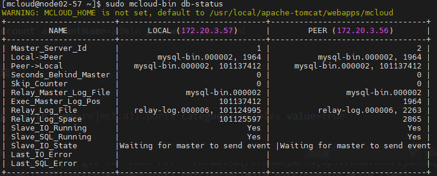
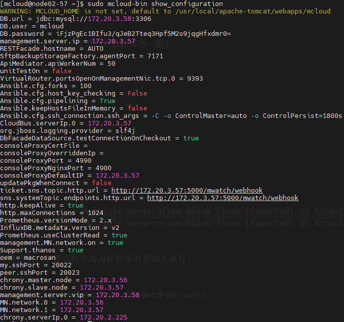
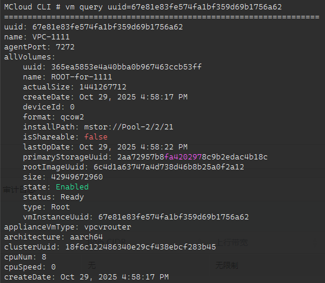
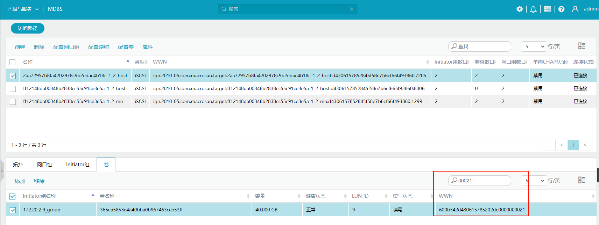
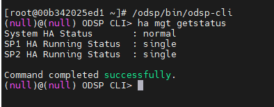

## mcloud-bin

* 获取mcloud服务运行状态及版本信息

```shell
mcloud-bin status
```

* 启动、重启、停止mcloud服务

```shell
mcloud-bin start
mcloud-bin restart
mcloud-bin stop
```

* 检查管理节点数据库状态(检查双管理节点数据库不一致)

```shell
mcloud-bin db-stauts
```



* 查看mcloud配置

```shell
mcloud-bin show_configuration
```



* 修改mcloud配置（修改配置后需重启所有管理节点的mcloud服务）

```shell
mcloud-bin configure [配置名]=[value]
# 例如修改从管理节点的ssh端口
mcloud-bin configure peer.sshPort=20023
```

## mcloud-cli

* 登录（若未做特殊声明，下述的指令均为在登录的基础上执行）：

  ```shell
  login withAccount accountName=admin password=password
  ```

* 集群开启防火墙：

  ```shell
  globalConfig update name=reject.all.ports category=iptables value=true
  ```

* 开启导出镜像端口

  ```shell
  globalConfig update category=iptables name=mcloud.allow.ports value=8080,60
  ```

* 修改numa值（对应计算规格在线修改）

  ```shell
  globalConfig update category=vm name=numa value=[true/false]
  ```
  
* 对接MacroSAN存储时，若ODSP的版本低于V3.0.19需要修改LUN类型：
  * 若MacroSAN存储上存储池为全HDD Pool，需要修改LUN类型为Thick
  * 其他情况修改LUN类型为Thin

  ```shell
  globalConfig update category=macrosan name=san.lun.mode value=[Thick/Thin]
  ```
  
* 以FC的方式对接MacroSAN时，需要配置FC端口的黑名单

  ```shell
  globalConfig update category=storageDevice name=FC.storage.blacklist value=50:0b:34:20:03:a2:1e:05,50:0b:34:20:03:a2:06:05(物理端口地址)
  ```
  
* 设置物理机保留内存
  * 以平台为单位(MCloud平台内所有物理机计算保留内存容量一致)：

    ```shell
    gloalConfig update category=kvm name=reservedMemory value=16G
    ```

  * 以集群为单位(MCloud存在多个集群，单个集群内所有物理机计算保留内存容量一致，不同集群间物理机计算保留内存容量不一致)：

    ```shell
    resource updateConfig resourceUuid=[集群uuid] category=kvm name=reservedMemory value=16G
    resource queryConfig resourceUuid=[集群uuid] category=kvm name=reservedMemory  // 查询
    ```

  * 以物理机为单位

    ````shell
    resource updateConfig resourceUuid=[物理机uuid] category=kvm name=reservedMemory value=16G
    ````

* 开启全局容错能力(搭建孪星双节点)

  ```shell
  globalConfig update category=ft name=ft.cluster.enable value=true
  ```

* 云盘更改主存储后，SAN对应的lun名称/mdbs对应卷名称都会改变，查询更改后的名称
  
  ```shell
  systemTag query tag~=overwrite sortBy=createDate sortDirection=desc resourceUuid=原云主机云盘uuid
  ```

* 开启混盘配置（根盘和数据盘可以跨主存储）

  ```shell
  globalConfig update category=vm name=attach.mixed.volume value=true
  ```

* 关机修改云主机计算规格

  ```shell
  vm changeOffering instanceOfferingUuid=(计算规格uuid) vmInstanceUuid=(云主机uuid)
  ```

* 查询云主机

  ```shell
  vm query uuid=[云主机uuid]
  ```



  通过查询云主机，可以获取到云主机的硬盘的vid（installpath:mstor://Pool-2/2/**21**），对应wwn：600b342d430615785202de**0000000021**。可在mdbs上直接搜索wwn后几位的vid搜索到卷



  云盘更改主存储后，SAN对应的lun名称/mdbs对应卷名称都会改变，查询更改后的名称也可以通过上述方法查询

## MDBS CLI

* 登录
  
  ```shell
  # 元数据节点
  mcli
  ```

* 通过卷的uuid查询卷信息

  ```shell
  volume mgt query --name [uuid]
  
  mdbs> volume mgt query --name fcf4563947634cfab5edf4fc87273760
  Command succeed.
  =================================================
  name:fcf4563947634cfab5edf4fc87273760 # name即对应uuid
  vid:133 # 对应卷installpath: mstor://Pool-2/2/133
  capacity(MB):40960
  used_cap(MB):3268.0
  size_kbyte:41943040
  used_kbyte:3346432
  status:0
  qos:0
  pid:2 # 对应卷installpath: mstor://Pool-2/2/133
  stripe_size(KB):64
  stripe_width:2
  strategy_id: 0
  related_snap: NA
  lun_type: clone
  rcache: 1
  master_proxy: 1
  snap_num: 0
  use_type: AP
  create_timestamp: 2025-11-14T16:05:30.497+08:00
  delete_timestamp: 0
  wwn: 600b342d4306157852fd580000000133 # 0000000133对应vid
  sn: 00b342d43061578528fd580000000133
  nguid: d43061578528fd5800b3420000000133
  mr_rate: 0
  verify: 0
  desc: N/A
  ```

## virsh

* 列出运行中的云主机

```shell
virsh list
```

* 列出所有云主机

```shell
virsh list --all
```

* 查看云主机**当前配置**信息(实时配置)

```shell
virsh dumpxml [UUID]
```

* 交互式地查看云主机的**持久化配置**

```shell
virsh edit [UUID]
```

* 云主机打流量更改主存储，任务超时报错，云主机仍在迁移中状态

```shell
virsh domjobinfo 云主机uuid
```

## SAN

* 查询SAN设备HA状态

```shell
# 进入odsp-cli
/odsp/bin/odsp-cli
# 获取高可用状态
ha mgt getstatus
```


