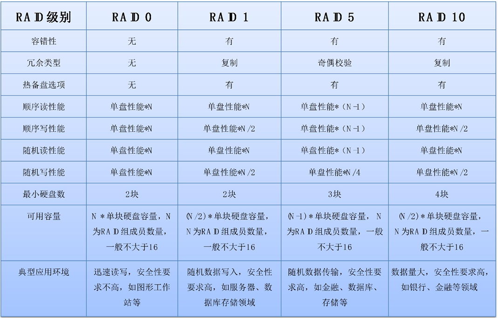
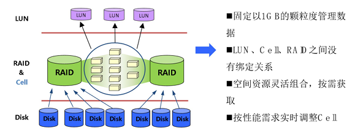

## 存储概述

* 磁盘阵列架构
  * 软件RAID：通过软件实现RAID功能，不需要额外的硬件设备，但是会耗费大量计算资源
  * 硬件RAID卡：由RAID卡提供RAID计算所需的资源，不会占用系统资源。但主机空间有限，一台主机无法连接很多硬盘；无法满足多个服务器需要共享存储资源的场景
  * 单控制器磁盘阵列：将RAID保护的功能从主机转移到主机外，实现存储与计算分离。通过SCSI、SAS、FC、IP等接口把更多主机同时连接到外部存储器上。
  * 双控制器磁盘阵列：单控制器存储本身存在单点故障，通过双控来提高存储的冗余性；通常两个控制器之间需要传递以下信息：控制器间的控制信息；控制器之间的心跳信息（HA检测用）；数据的跨控制器传输。
  * 多控制器磁盘阵列：通过将更多的控制器组织起来一起提供存储服务，可以获得更强的性能。

* 补充常见的RAID类型：RAID-0，RAID-1，RAID-5，RAID-6，RAID-10：
  * RAID-0（条带化）：至少需要两块硬盘。数据被分割成多个“条带”，然后并发地、均匀地写入到所有硬盘中。写数据时将数据分为N份，以独立的方式实现N块磁盘的读写，将N份数据并发写入磁盘中，性能非常高，没有冗余，任何一块硬盘发生故障，所有数据都会损坏且无法恢复
  * RAID-1：至少需要两块硬盘。将同一份数据无差别的写两份到磁盘（将磁盘分为两份，一份工作，一份镜像），有镜像冗余
  * RAID-10：至少需要4块硬盘。首先基于RAID-1模式将磁盘分为两份，随后将这两份RAID-1以RAID-0模式组合起来，既保证了效率又保证了安全，有镜像冗余
  * RAID-5：至少需要3块硬盘，数据分布存储（类似RAID-0）+ 奇偶校验信息（用于恢复数据）轮流存储在不同的硬盘上，单盘冗余
  * RAID-6：类似与RAID-6，但是至少需要4块硬盘，双硬盘冗余

* 多控制器架构
  * scale-up：纵向扩展，直接扩展部件。按照功能不同将控制器分为CPU、缓存、前端接口和后端接口等模块，这些模块可以通过高速背板互相访问。当性能不满足应用要求和负载时，在背板中加入更多的模块以此来提高存储系统的性能。
  * scale-out：横向扩展，这种方式的思想是分布式计算，通过增加标准的、相对廉价的节点到同一个集群中，来线性地提升整个系统的性能和容量。

* 存储器控制器架构：
  * RISC：精简指令集计算机，设计简单，速度快。单由于标准化程度差，发展比较缓慢；性能不高。
  * CISC：复杂指令集计算机，主要是Intel、AMD的x86处理器。已成为中断存储产品的主流首选，逐步应用于高端产品。
  * ASIC：专用集成电路，专为存储的RAID处理而设计，实现复杂，架构封闭，可移植性差，多采用CISC+ASIC混合架构。

* SAS技术
  * SAS全称Serial Attached SCSI（串行连接SCSI），是由SCSI演变而来，将SCSI的并行改为了串行
  * SAS在物理连接器上与SATA保持兼容，但功能和协议更强大。
  * 单根SAS2.0速率可以达到6Gb，SAS4.0速率可以达到22.5Gb，并且支持双端口聚合。
  * SAS支持全双工通信，意味着它可以同时读取和写入操作，与SATA的半双工相比，效率翻倍。

* 写缓存镜像：将写缓存数据做两个拷贝，分别放在主缓存和镜像缓存中，系统工作时会同时向两个缓存中写入数据。有写缓存镜像时，数据的写入需要经过一下步骤。
  * 1.主机数据写入主控制器缓存；
  * 2.将缓存数据复制到对端控制器；
  * 3.对端控制器接受完整数据后返回确认消息；
  * 4.源控制器返回主机写成功，写操作完毕。

* 缓存掉电保护技术：
  * 1.外置UPS（不间断电源）：当出现供电故障时UPS可以保证磁盘阵列正常工作
  * 2.内置电池：当控制器出现供电故障时为控制器持续供电
  * 3.非易失性存储器：在控制器内部内置一个小硬盘或者小容量的非易失性缓存，当断电时将缓存内的数据临时写入小硬盘或者是非易失性的缓存里，等系统恢复时再将数据读回缓存
  
## RAID及CRAID技术

* RAID中文全称独立磁盘冗余阵列，或简称磁盘阵列。初衷是为了组合小的廉价磁盘来代替大的昂贵磁盘，同时希望磁盘失效时不会令数据受损。它将多个独立的物理磁盘按照某种方式组合起来，形成一个虚拟的磁盘，作为一个独立的存储资源出现。

|||
|---|---|
|RAID 0|数据条带化，无校验|
|RAID 1|数据镜像，无校验|
|RAID 2|海明码错误校验及校正|
|RAID 3|数据条带化读写，校验信息存放于专用硬盘|
|RAID 4|单次写数据采用单个硬盘，校验信息存放于专用硬盘|
|RAID 5|数据条带化，校验信息分布式存放|
|RAID 6|数据条带化，分布式校验并提供两级冗余|
|RAID 01|先做RAID 0，后做RAID 1|
|RAID 10|先做RAID 1，后做RAID 0|
|RAID 50|先做RAID 5，后做RAID 0|

常见RAID级别比较

* RAID组织数据的方式
  * 1.分区：一组地址连续的存储块，单个磁盘可以有一个或多个分区
  * 2.条块：分区可以进一步细分为更小的段，被称为条块。**是条带的元素**
  * 3.条带：**分区和条块是在单个磁盘上进行的**。条带是**磁盘阵列**中的两个或多个分区上的一组**位置相关**的条块。"位置相关"意味着，每个分区上的第一条块属于第一条带，每个分区上的第二条块属于第二条带...组成条带的**条块大小**也被称为**条带深度**，每个条带**跨越的磁盘数**被称为**条带宽度**，条带宽度*条带深度就是每个条带的裸容量。

* RAID5的三种写方式
  * 1.整条写：如果一次硬盘写操作刚好映射满一个条带，则相应的校验值可根据新的数据块直接计算出来，该过程可在RAID的缓存中直接完成。不需要任何多余的读操作，是RAID5中效率最高的一种写操作
  * 2.重构写：如果一次写硬盘的数据包括一个条带的多数个数据块时，则产生新的校验信息时必须先将没有更新的数据读到缓存中，计算出新的校验信息，然后再将新数据与新校验信息一起写到磁盘中。相比于整条写多了一个读旧数据的操作
  * 3.读改写：如果一次写操作只更新了条带中极小部分的数据，为了计算新的校验值，需要读出条带中原来的数据，然后将计算的新的校验数据和新数据一起写到磁盘中

* 同步：创建完RAID组后，立即将所有数据盘中的数据进行异或算法，得到的结果写入校验盘，这个过程就叫同步
* 重建：当RAID组中的某一块盘发生故障时，用一块空的热备盘（能随时顶替故障盘的备份盘）替换该故障盘，此时就需要通过RAID组中其他数据盘和校验盘将故障盘的数据恢复给热备盘，达到重建的功能。重建不影响存取操作的连续性，但会影响性能

* RAID机制冗余方式：
  * 镜像冗余
  * 校验冗余

* CRAID（Chinese-RAID）：是宏杉科技以中国命名的一项存储专利技术，帮助用户可以放心地大量采用SATA硬盘同时避免硬盘频繁故障带来的数据丢失风险

* CRAID原理：
  

  * cell是灵活的数据单元，是存储资源管理的基本单元
  * 在传统RAID中，LUN，RAID，Disk这3者之间是捆绑关系，当RAID组中有磁盘坏块，传统技术的处理是直接踢盘，热备盘顶替，如果没有热备盘，RAID就会处于降级状态
  * CRAID是以cell为核心，在创建RAID的时候按照cell为基本单位进行划分，并在此基础上去创建LUN。破除了LUN，RAID，Disk之间的捆绑关系。（也就是多了一层虚拟化）

* CRAID和RAID重建方式比较
  * 传统RAID5，磁盘出现数据坏块，整个磁盘不可用，被踢出，如果有热备盘，热备盘顶上，
进行全盘重建，这个过程需要花费较长时间。而CRAID技术，CRAID5中数据盘出现数据坏块即其中的一个Cell故障，由预留的Cell替换，且只重建坏块的数据，Cell中正常的数据进行拷贝，大大缩短了重建时间