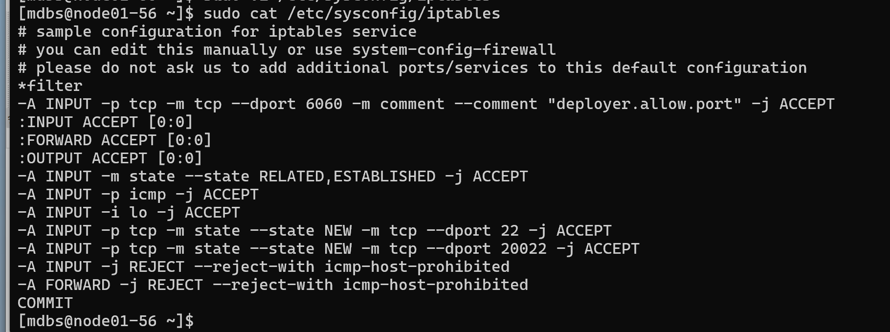

## 新增sudo用户和修改ssh端口

* 1.从已部署好的MCloud_V3.4.3环境中取用脚本，路径`/home/mcloud/security`

    ```text
    create_sudo_user.sh # 创建sudo 用户
    disable_root_login.sh # 是禁止root用户登录
    ssh_port_add.sh # 添加ssh端口
    ssh_port_remove.sh # 移除ssh端口
    ```

* 2.使用脚本`create_sudo_user.sh`新增两个用户
  
  ```sh
  create_sudo_user.sh mcloud wvu7G55U
  create_sudo_user.sh mdbs wvu7G55U     # mdbs用户为部署MDBS时必须使用的用户
  ```

* 3.使用脚本添加新ssh端口
  
  ```sh
  ssh_port_add.sh 20022 # 新增20022端口
  ssh_port_remove.sh 22 20022 # 移除原22端口

  ssh_port_add.sh 22 # 防止后续操作可能造成防火墙问题，建议再将22端口先打开

  # 添加防火墙规则
  iptables -I INPUT -p tcp --dport 20022 -m comment --comment "new ssh port" -j ACCEPT

  # 停止并禁用firewalld
  systemctl stop firewalld
  systemctl disable firewalld
  ```

## 脚本部署MDBS

**部署MDBS过程中使用`mdbs`用户操作**

* 1.**在每个节点**新增`/etc/ms_ssh_port.conf`文件并写入添加的ssh端口号
  
  ```sh
  sudo vi /etc/ms_ssh_port.conf
  ```

* 2.将MDBS部署包拷进路径`/home/mdbs/MDBS_V5.2.0/`下
  完整部署包应包含以下文件
  
  ```text
  config.yaml
  host.conf
  install_mdbs.sh
  MD5.txt
  MDBS_V5.2.0-openEuler-x86_64.zip # MDBS部署文件，以部署的版本为准
  ```

* 3.修改`config.yaml`文件
  
  ```sh
  vi config.yaml

  # 新增
  ansible_port: 20022 # 注意格式一致

  # 其余配置按实际情况修改
  ```

* 4.修改`host.conf`文件

  ``` sh
  vi host.conf

  # 配置好节点信息

  # 填写mdbs用户的信息
  ansible_user=mdbs
  absible_ssh_pass=wvu7G55U
  ```

* 5.执行安装脚本

  ```sh
  sh install_mdbs.sh
  ```

* 安装过程中可能会因iptables规则消失
  需将规则写入配置文件中

  ```sh
  sudo vi /etc/sysconfig/iptables
  # 在:OUTPUT ACCEPT下面新增

  -A INPUT -ptcpm state--state NEWm tcp --dport 20022 -j ACCEPT
  ```

  

  随后重启iptables

  ```sh
  systemctl restart iptables
  ```
  
  就可以再次执行安装脚本了

## 脚本部署MCloud

* 1.使用非root用户将MCloud的压缩包上传进用户目录(/home/mcloud)下
* 2.创建安装目录 并将压缩包移动进安装目录

  ```sh
  sudo mkdir -p /opt/deploymdbsandmcloud/mcloud/tar/
  sudo mv MCloud_V3.4.3.tgz /opt/deploymdbsandmcloud/mcloud/tar/
  ```

* 3.解压安装包

  ```sh
  cd /opt/deploymdbsandmcloud/mcloud/tar/
  sudo tar -zxvf MCloud_V3.4.3.tgz
  ```

* 4.修改`mcloud-install.config`文件

  ```sh
  cd MCloud_V3.4.3
  vi mcloud-install.config
  ```

  根据实际情况修改配置文件

  ```text
  {
  "virtualIp": "",  # VIP
  "myIp": "172.20.2.29",           # 本节点管理IP ，按照实际环境修改
  "mySshUser": "root",            # 本节点ssh用户，默认root
  "mySshPass": "wvu7G55U",     # 本节点ssh密码，默认密码wvu7G55U，按照实际环境修改
  "peerIp": "", 
  "peerSshUser": "", 
  "peerSshPass": "",
  "dbRootPass": "Macro3",   # 数据库密码，默认设置Macro3
  "virtualRouterId": "66",     # 虚拟路由ID，建议设置为66
  "interface": "bond0",    # 管理网口名称，与网络配置章节3.3.2保持一致，本文档以bond0为例
  "timeServer": "172.20.2.29",      # NTP服务器IP，建议填写本节点管理IP
  "gateway": "172.20.0.254",        # 网关地址，按照实际环境修改
  "replicationIps": [["", ""], ["", ""]], # 备用ip，有ip异常了，就会切到别的ip。可不填
  "mySshPort": "22",         # 本节点ssh端口，默认22
  "peerSshPort": "" 
  }
  ```

* 5.执行安装脚本

  ```sh
  sudo sh mcloud-install.sh
  ```

## 脚本部署仲裁者

* **步骤同脚本部署MDBS，仲裁者节点也需要使用非root用户-mdbs用户部署**
